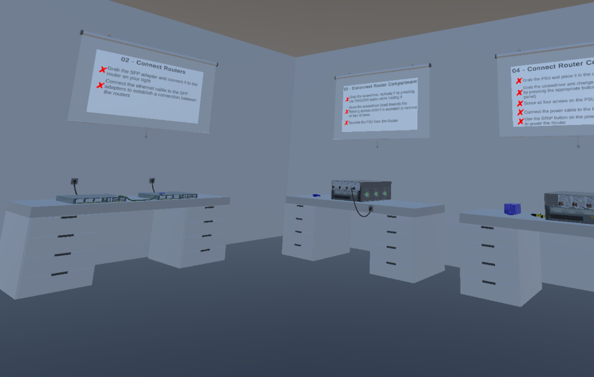
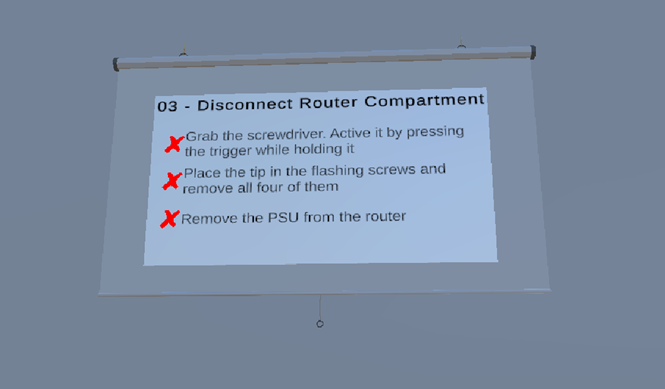
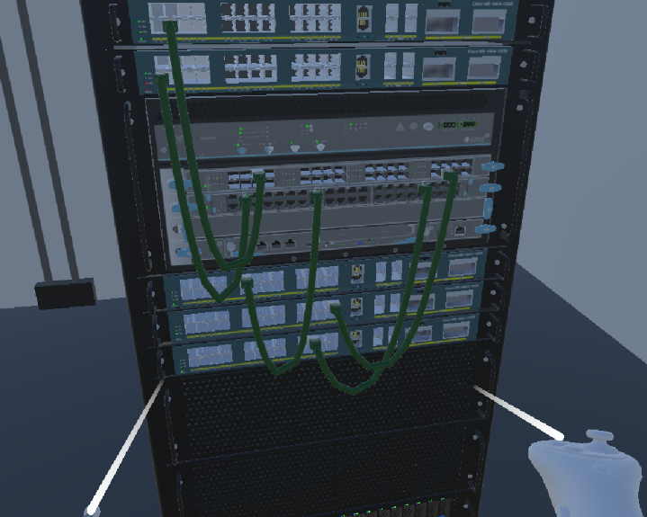
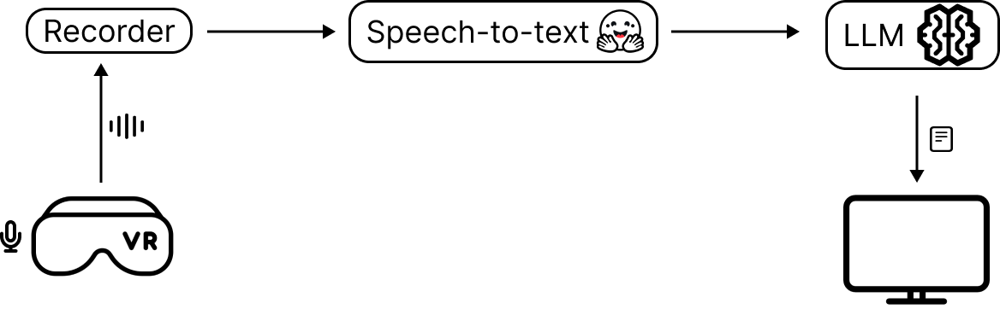

# XR2IND-VR
**XR2IND-VR** is a Unity-based application designed for industrial training. It features three different virtual classrooms—tutorial, assembly, and troubleshooting—where trainees can practice tasks using interactive 3D models of routers, switches, and related components like cables, SFPs, fan compartments, and line cards.

## Virtual Classrooms

- **Tutorial Room**: Helps trainees get comfortable with VR controls, making it ideal for first-time VR users.
- **Assembly Room**: Users are tasked with assembling routers from individual components.
- **Troubleshooting Room**: Trainees troubleshoot issues in a virtual routing room with multiple installed routers.

In all rooms, a language model assistant (LLM) can assist trainees by interacting with them through speech. Training objectives are displayed on whiteboards, which show the required steps and the status of each task.



## Whiteboard

The **whiteboard** serves as a guide, displaying the steps required to complete tasks and showing the real-time status of each one. For example, when a trainee connects two ports correctly, the task is marked as successful. If the trainee disconnects a cable later, the task will update to reflect the failure.



## 3D Interactive Models

The app features interactive 3D models of three routers/switches:

- **Cisco ME4924**
- **Juniper EX9204**
- **Juniper MX480**

These models include various components such as line cards, routing engines, power supplies (PSUs), and fans. Trainees can interact with these components using VR controls to perform tasks like inserting line cards, connecting cables, and powering on devices. Other interactive objects include standard tools and cables like electric screwdrivers, power cables, Ethernet cables, and power outlets.



## VR Application Integration with AI

XR2IND's primary goal is to blend immersive VR environments with the intelligence of language models and chatbots for enhanced training experiences. The application connects to the **LLM-ChatEngine REST API** to communicate with an OpenAI agent, allowing trainees to ask questions and receive guidance in real-time. The interaction follows this process:

1. The trainee activates the chat assistant using the VR controller.
2. Speech is converted to text using a speech-to-text module.
3. The text is sent via the REST API to the OpenAI agent.
4. The agent generates a response using the appropriate query engines and returns the answer to the trainee in the VR environment.



The application ensures the accuracy of the LLM's responses by leveraging offline manuals containing configuration, assembly, and installation instructions for the routers and switches used in training. These manuals are uploaded to XR2IND’s Retrieval-Augmented Generation (RAG) module via an upload API, where the documents are processed for retrieval and response generation.

For more details on the LLM-ChatEngine, visit the [GitHub repository](https://github.com/giorgosfatouros/llm-chat-engine).

## Speech-to-Text Component

The app integrates speech-to-text functionality using the Hugging Face Unity API. The audio input is processed through the **whisper-tiny.en** model, which converts the speech into text for interaction with the LLM.

## Deployment Setup

### Environment Preparation

XR2IND is developed in Unity (version 2022.3.19f1) and runs on the Meta Quest 3 headset. Follow these steps to prepare your environment:

1. **Download Unity Hub**: [Unity Hub Download](https://unity.com/download).
2. **Install Unity**: In Unity Hub, navigate to the [Download Archive](https://unity.com/releases/editor/archive) and install version 2022.3.19f1.
3. **Install Meta Quest Link**: Install the Meta Quest Link application on your computer and connect your Meta account.
4. **Enable Quest Link**: On your Meta Quest 3 headset, open the universal menu, go to “Settings” > “System” > “Quest Link,” and enable the Quest Link option.

### Download & Deployment

Once Unity is installed and the headset is set up, follow these steps to deploy the XR2IND application:

1. **Clone the Repository**: Download the project files by cloning the GitHub repository.
2. **Add the Project to Unity Hub**: Open Unity Hub, click “Add” > “Add project from disk,” and select the project directory.
3. **Connect the Headset**: Use a USB 3.0 cable to connect your Meta Quest headset to your computer.
4. **Access Quest Link**: From the Quick Settings on the bottom-left of the menu bar, select the computer your headset is plugged into and launch the connection.
5. **Open the Project**: Open the project in Unity from Unity Hub.
6. **Load the First Scene**: In the “Project” tab, navigate to `Assets/Scenes` and open the `ScenarioSelect` scene by double-clicking on it.
7. **Run the Scene**: Press the “Play” button at the top of the Unity Editor window to run the application.
8. **Optional Windows Build**: To create a standalone Windows application, go to `File` > `Build And Run` to generate a `.exe` file.

### LLM Chat Engine Deployment

To deploy the LLM chat engine:

1. Clone the LLM-ChatEngine repository and navigate to the project directory.
2. Set your OpenAI API key in the `Dockerfile` and `docker-compose.yml` files.
3. Build the Docker image:  
   ```
   docker build -t llm-engine .
   ```
4. Start the service:  
   ```
   docker-compose up
   ```
